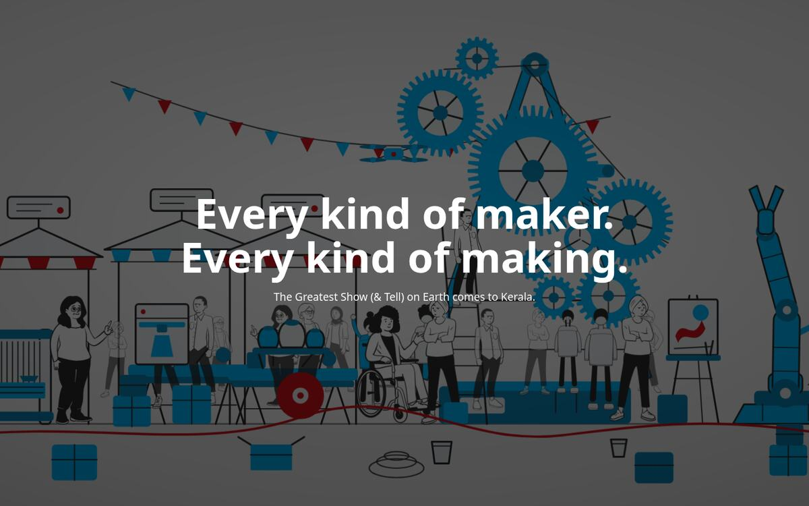
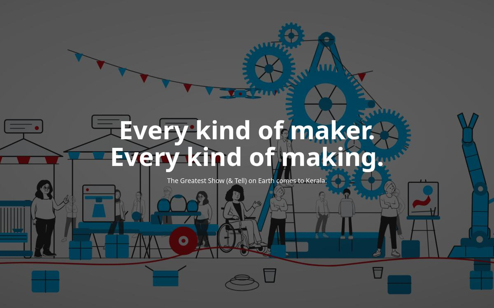
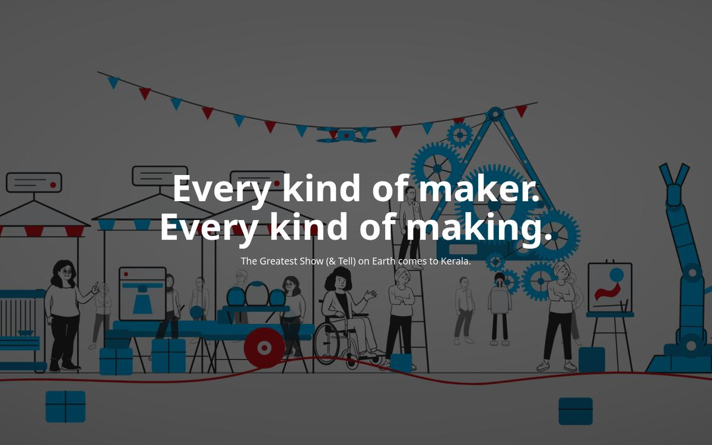
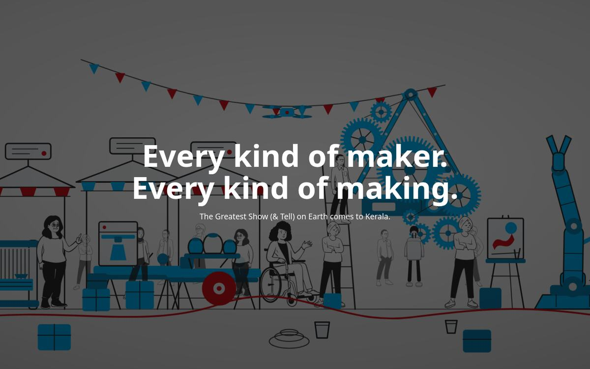
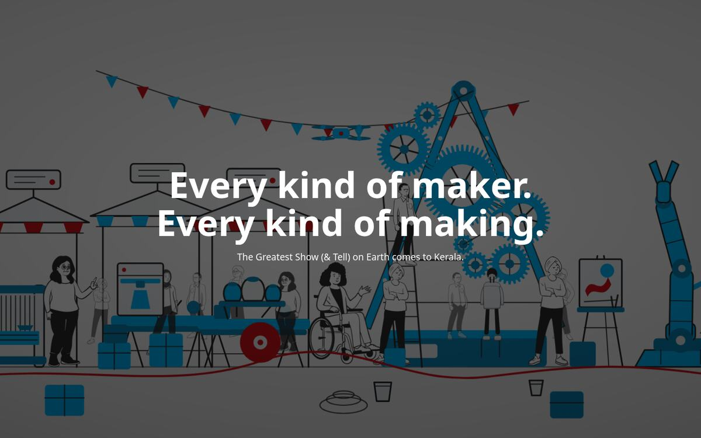

# Thinning the faire — hero crowd density

Status: **implemented** (variant C, with one change to how the gear tower shrinks — see below).
The crowd cut and the foreground cut shipped exactly as proposed.

## The finding

The hero reads as crowded and the six-machine cut is not why. The machines are already down to
six and the scene body is only 58.6 KB of the 217.6 KB component.

**The gaps between people are narrower than the people.** Every figure, left to right, with the
gap to its neighbour:

| x | gap | zone | | x | gap | zone |
|---:|---:|---|---|---:|---:|---|
| 277 | — | craft | | 1010 | 60 | back-view |
| 347 | 70 | craft | | 1048 | 38 | kinetic |
| 463 | 116 | fab | | 1096 | 48 | tower (ladder) |
| 527 | 64 | fab | | 1141 | 45 | kinetic |
| 567 | 40 | fab | | 1240 | 99 | kinetic |
| 689 | 122 | ceramics | | 1310 | 70 | back-view |
| 755 | 66 | ceramics | | 1380 | 70 | back-view |
| 826 | 71 | ceramics | | 1448 | 68 | apron |
| 890 | 64 | back-view | | 1480 | 32 | apron |
| 950 | 60 | wheelchair | | | | |

19 figures across x 277–1480. Mean gap **67 units**, largest gap anywhere **122**. A front-row
figure is about **99 units wide** — so at 99 units per body on a 1920-unit frame, 19 figures tile
the frame almost solid. That is the wall you are seeing.

### The cause is the hand-placed figures, not the zones

The zones in `placement.cjs` do leave air: 880→1030 is a deliberate 150-unit gap, and nothing is
pooled past x=1270. But **8 of the 19 are placed by hand outside that system**, and the
back-views' own comment says their x positions "sit in the widest gaps in the crowd." The 150-unit
gap is plugged by three figures (890, 950, 1010); the open right third is plugged by four (1310,
1380, 1448, 1480).

The zone design bought air and the hand-placement spent it.

## The variants

All rendered at t=6000 through `scripts/preview.cjs` at 1440×900, with the 0.58 scrim and hero
type composited exactly as the page ships them.

### Now — 19 people

One unbroken band of people edge to edge. The printer, the bench and the pot shelf cannot be read.

### A — crowd thinned, nothing else

13 people. One figure each from `fab`, `ceramics` and `kinetic`, and three of the four back-views —
including the two plugging the 880–1030 gap. The craft pair, ladder figure, apron pair and
wheelchair all stay.

### B — plus gears tamed, foreground cleared

Calmest of the four, but the foreground goes bare. `machinery.cjs` warns about exactly this: bare
ground "reads as an unfinished drawing."

### C — plus gears tamed, foreground kept

The direction that was chosen. The coil and two buckets anchor the foreground; the gears stop
dominating.

### As shipped

Variant C's crowd and foreground exactly as drawn, but the tower is shrunk through `MODULE_R`
rather than a wrapper `scale()` — see the next section. The A-frame therefore keeps its full size
and stays planted, and only the gear train shrinks.

## Numbers

| Measure | Now | A | B | C | Shipped |
|---|---:|---:|---:|---:|---:|
| People in frame | 19 | 13 | 13 | 13 | **13** |
| Mean gap | 67 | 100 | 100 | 100 | **100** |
| Largest gap | 122 | 157 | 157 | 157 | **157** |
| Gear train footprint | 587×619 | 587×619 | 411×433 | 411×433 | **425×448** |
| Loose foreground objects | 7 | 7 | 2 | 5 | **5** |
| Generated component | 217.6 KB | 207.7 KB | 207.5 KB | 207.6 KB | **207.7 KB** |
| Unique poses in `<defs>` | 6 | 6 | 6 | 6 | **6** |
| `scene:grounded` | pass | pass | **FAIL** | **FAIL** | **pass** |

## Notes

**Cutting people is nearly free in bytes.** The saving is only ~10 KB, because all six poses stay
in use — `<defs>` is unchanged at 159 KB. This is a legibility change, not a payload one. The
payload lever is still `POOL`.

**Any zone-count edit reshuffles everyone.** Changing a count changes how many values the seeded
RNG deals, so every figure in every zone moves, not just the ones removed. All three variants
re-passed `scene:check` and `scene:spacing`; nearest pair is 32 units, above the 24-unit floor.

**B and C were not shippable as drawn — this was fixed, not shipped broken.** Shrinking the gear
tower with a `scale(0.7)` wrapper drags its feet up with everything else, because the plinth,
A-frame feet and cross-members are authored at absolute y (806, 812, 822, 902) while only the gear
train is positioned by `wantCx`/`wantBase`. `scene:grounded` flagged the tower floating 46 units
above its nearest support.

The fix was to shrink the train through **`MODULE_R` 2.9 → 2.1** (scene units per tooth) and drop
the wrapper entirely. Periods are `teeth × SEC_PER_TOOTH` so they are untouched, and centre
distance stays exactly `rParent + rSelf` because both radii come from `radiusFor()`. The plinth
never moves, so `scene:grounded` now reports the tower resting at 902.

What `MODULE_R` does **not** scale: strut widths, the hub radius (clamped at 11, so the 12-tooth
gear's spokes are short), the plinth, and the governor, which is now larger than the `g4` it hangs
off. All four were inspected at t=6000 and t=19000 and still read as one machine.

**The headline cannot fully clear the gears.** To sit entirely below the type the tower would need
a base at y 1009, past the ground line at 902. Shrinking reduces how much it fights the words; it
cannot end the fight. Cutting the train from seven wheels to five is the next lever if C still
reads busy.

## What changed, file by file

- `scene/placement.cjs` — `ZONES` counts `fab` mid 2→1, `ceramics` mid 2→1, `kinetic` mid 1→0;
  `BACK_VIEWS` reduced to the single x=1310 entry. Its doc comment no longer tells the next person
  to aim back-views at the widest gaps, since that is what caused this.
- `scene/gearTower.cjs` — `MODULE_R` 2.9 → 2.1, with the reason recorded next to it.
- `build-scene.cjs` — dropped `PR.openBox(636, 946)` and `PR.crates(1738, 946)`; `DESC` now says
  thirteen makers, one with their back to us (it is the screen-reader description of the scene and
  goes stale silently); the header's "19-strong crowd" is now 13.
- `check-spacing.cjs` — comment count only. `BACKS` is derived from `BACK_VIEWS`, so no logic moved.
- `CLAUDE.md` — crowd-size and gear-sizing rules added; payload table re-measured. A pre-existing
  claim that `BACKS` must be hand-synced with `build-scene.cjs` was **wrong** and is corrected.

## Verified

`npm run scene` (extract → measure → build → check → spacing → grounded) passes; `scene:grounded`
reports nothing floating and the tower resting at 902. `scene:verify-loop` gives 0.000 RMSE against
mid-cycle controls of 0.228 / 0.257 / 0.228. `scene:check` passes 25 declared periods.
`scene:spacing` passes 66 figure pairs, nearest 32 units. `scene:contrast` gives 5.32:1 worst-case
white-on-scene at the shipped `--hero-dim: 0.58`. The component parses as strict XML.
`npm run build` succeeds; SSR HTML is 237.6 KB raw / 84.7 KB gzip / 69.9 KB brotli, and no client
JS chunk contains figure data.
